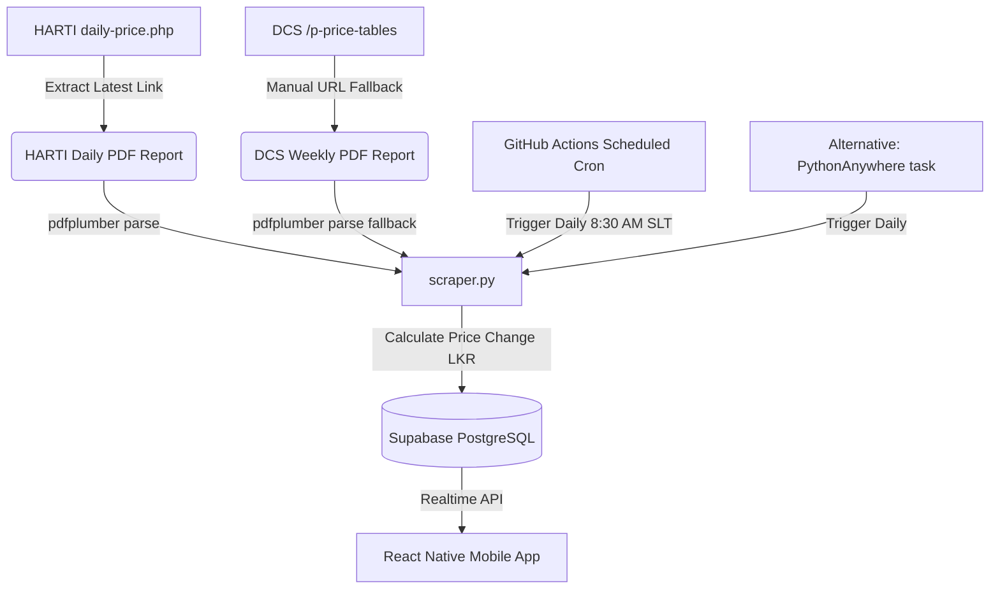

# GoviGana (ගොවිගණ) — Sri Lankan Farmer Wholesale Price Tracker

GoviGana is a complete, working agricultural wholesale price tracking mobile app MVP designed for Sri Lankan farmers. It displays daily commodity prices from HARTI daily bulletins and DCS fallback reports, optimized with large fonts and high-contrast visuals for outdoor viewing under bright sunlight.

---

## 🏗️ Technical Architecture



---

## 1. Supabase Database Setup

1. Open your **Supabase Dashboard** and navigate to the **SQL Editor**.
2. Copy and paste the contents of [create_prices.sql](file:///c:/Users/DINETH/OneDrive/Documents/Git-Hub/govigana-mobileapp/supabase/migrations/202606170000_create_prices.sql) and click **Run**.

**What this migration script does:**
* Creates the public `prices` table to store agricultural wholesale prices.
* Creates the public `scraper_runs` table to log scraper status and row counts.
* Sets up a `unique_market_crop_date` unique constraint on `(market, crop, date)` to support database upserts and prevent duplicate pricing rows.
* Creates performance indexes on `(market, date)` and `(crop, date)` for rapid query response times.
* Enables Row-Level Security (RLS) policies on both tables, granting public read-only access (`SELECT`) to anonymous users, and full access (`INSERT`, `UPDATE`) only to the database `service_role` (used by the scraper).

---

## 2. Python Scraper Setup

The backend scraper script is located in [scraper.py](file:///c:/Users/DINETH/OneDrive/Documents/Git-Hub/govigana-mobileapp/scraper.py).

### Local Installation:
1. Install the required Python libraries:
   ```bash
   pip install -r requirements.txt
   ```
2. Create a local `.env` file in the root project folder containing:
   ```env
   SUPABASE_URL=https://your-project.supabase.co
   SUPABASE_SERVICE_KEY=your-supabase-secret-service-role-key
   DCS_PDF_URL_PATTERN=https://www.statistics.gov.lk/WebReleases/retail_2026-06-15.pdf  # (Optional Fallback URL)
   ```
3. Run the local dry-run verification test script:
   ```bash
   python test_scraper.py
   ```
   *(This downloads and extracts vegetable & fruit prices from the real HARTI website, printing a console log sample without writing to the database).*
4. Run the actual database writer scraper:
   ```bash
   python scraper.py
   ```

### Scraping Logic Details:
* **HARTI Daily Scraper**: Connects to `https://www.harti.gov.lk/daily-price.php`, parses the HTML list to find the latest daily English PDF bulletin, downloads it, and parses the table on Page 1 using `pdfplumber` to extract Colombo (Peliyagoda) and Dambulla market columns.
* **DCS Fallback Scraper**: Bypasses the robots-disallowed DCS listing index page by downloading the specific, manual PDF URL specified in the `DCS_PDF_URL_PATTERN` environment variable. If price ranges like "180-200" are found in the PDF columns, the scraper selects the minimum value.

---

## 3. Scraper Deployment Options

### Option A: GitHub Actions (Recommended, Free)
A daily scheduling workflow is preconfigured in [daily-scrape.yml](file:///c:/Users/DINETH/OneDrive/Documents/Git-Hub/govigana-mobileapp/.github/workflows/daily-scrape.yml).
It triggers automatically every day at **8:30 AM Sri Lanka Time (03:00 UTC)**.

**GitHub Setup Steps:**
1. Navigate to your GitHub Repository -> **Settings** -> **Secrets and variables** -> **Actions**.
2. Register the following Repository Secrets:
   - `SUPABASE_URL`: Your Supabase API endpoint.
   - `SUPABASE_SERVICE_KEY`: Your secret service role key (bypasses RLS to write to tables).
   - `DCS_PDF_URL_PATTERN`: (Optional) The manual download URL for the weekly DCS PDF report.

### Option B: PythonAnywhere Hosting
Due to whitelist restrictions on PythonAnywhere's free tier, a paid plan is required to fetch files from `.gov.lk` servers.

**PythonAnywhere Setup Steps:**
1. Open a **Bash Console** in PythonAnywhere.
2. Clone this repository:
   ```bash
   git clone https://github.com/Dineth111/govigana-mobileapp.git
   cd govigana-mobileapp
   ```
3. Initialize a Python virtual environment and install packages:
   ```bash
   mkvirtualenv --python=/usr/bin/python3.10 govigana-env
   pip install -r requirements.txt
   ```
4. Edit the `.env` file in the project folder to include your credentials.
5. Open the **Tasks** tab in PythonAnywhere and create a new daily scheduled task:
   - **Command:** `workon govigana-env && python /home/yourusername/govigana-mobileapp/scraper.py`
   - **Time:** Set to trigger once daily (e.g., 03:15 UTC).

---

## 4. Mobile App Setup

The Expo React Native codebase is located inside the [src/](file:///c:/Users/DINETH/OneDrive/Documents/Git-Hub/govigana-mobileapp/src) folder.

### Local Development:
1. Install Node modules:
   ```bash
   npm install
   ```
2. Verify or create a `.env` file at the root folder:
   ```env
   EXPO_PUBLIC_SUPABASE_URL=https://your-project.supabase.co
   EXPO_PUBLIC_SUPABASE_KEY=your-supabase-public-publishable-anon-key
   ```
3. Test your credentials connection:
   ```bash
   node check_db.js
   ```
4. Start the Expo bundler server:
   ```bash
   npx expo start
   ```
5. Scan the generated QR code using the **Expo Go** app on your Android or iOS device.

### Core Application Features:
* **Offline Caching**: Automatically saves fetched prices to the device using `AsyncStorage`. On launch, the app displays cached data instantly, ensuring it is functional even when there is no internet connection.
* **Warning Badge**: If retrieved price data is older than 24 hours (e.g., if a scraper failed or the fallback was used), the app displays a prominent amber warning badge at the top.
* **Search & Filters**: Users can choose between Colombo, Dambulla, Narahenpita, and Mannar markets, filter by Vegetables or Fruits categories, and search for crops in Sinhala.
* **7-Day Trend Charts**: Tapping a crop card opens a modal displaying a price history line chart using `react-native-chart-kit` and provides native Sharing functionality to share price alerts.
